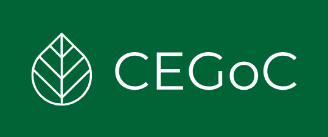

  

# CEGOC - Ciência, Expertise e Governança Climática

CEGoC é um projeto de pesquisa desenvolvido por Lorena e André, que visa compreender a política pública climática federal e sua governança institucional no Brasil. Este repositório contém os arquivos e ferramentas necessárias para o desenvolvimento de um aplicativo web que permitirá visualizar e analisar os componentes da Política Nacional sobre Mudança Climática e sua governança.

## Tecnologias Utilizadas

O Web App é desenvolvido utilizando as seguintes tecnologias:

- **Python**: Linguagem de programação principal.
- **Pandas**: Biblioteca para análise e manipulação de dados.
- **MySQL**: Sistema de gerenciamento de banco de dados.
- **Streamlit**: Biblioteca para criar interfaces web interativas.

## Contexto do Projeto

O projeto **CEGoC** (Ciência, Expertise e Governança Climática) tem como objetivo principal a análise e visualização dos instrumentos que compõem a política pública climática federal e sua estrutura de governança institucional. Através de um levantamento sistemático e análise documental, buscamos compreender a configuração da governança institucional a partir dos instrumentos da Política Nacional sobre Mudança Climática e audiências e consultas públicas relacionadas.

### Metodologia

1. **Levantamento Sistemático**: A primeira etapa envolveu a sistematização da estrutura de governança em planilhas, permitindo uma análise documental aprofundada.
2. **Coleta e Análise**: Foram coletados dados sobre organizações, iniciativas, atos normativos, audiências e consultas públicas, e pessoas. Esses dados foram organizados em planilhas principais e auxiliares, com uma planilha dedicada a documentos relacionados.

### Estrutura do Banco de Dados

O banco de dados desenvolvido, quando concluído, conterá:

- **Organizações**
- **Iniciativas**
- **Atos Normativos**
- **Audiências e Consultas Públicas**
- **Pessoas**
- **Arquivos**: Documentos relevantes para cada elemento.

O banco de dados foi inicialmente estruturado no Google Sheets e está depois adaptado para um banco de dados relacional MySQL.

## Objetivo do Web App

O objetivo inicial do web app é permitir a visualização dos componentes do banco de dados e a identificação de suas conexões. Em fases futuras, serão desenvolvidas análises mais complexas e novas visualizações.

## Status Atual

Atualmente, o repositório está na fase de desenvolvimento da estrutura básica e das visualizações individuais de cada componente, além da ferramenta de busca no banco de dados.
